# Guida Utente — N2O DVR

Benvenuti nella piattaforma **N2O DVR**, il sistema per la generazione automatizzata dei documenti di sicurezza sul lavoro (DVR Master e allegati). Questa guida è pensata per operatori di campo, operatori d'ufficio e amministratori. Il principio alla base della piattaforma è semplice: **il vostro lavoro deve essere di revisione, non di inserimento manuale del dato**.

## Introduzione

La piattaforma permette di:

- Gestire l'anagrafica dei clienti (**Aziende**).
- Raccogliere i dati del sopralluogo attraverso un questionario digitale in 7 passaggi.
- Generare automaticamente il **DVR Master** (~187 pagine) e i suoi allegati (MMC, VDT, Stress, Incendio, Microclima, Biologico, Gestanti).
- Produrre i documenti complementari (PEE, HACCP, DUVRI, POS).
- Revisionare il DVR direttamente in **Google Docs** e riportare le modifiche come nuova versione.
- Scaricare tutti i documenti in formato `.docx`.

Tutto l'output è in italiano e conforme al **D.Lgs. 81/2008** e alle norme tecniche collegate.

---

## Quick Start — Primo utilizzo in 10 minuti

Il percorso tipico per generare il primo DVR si articola in sei passaggi. Ogni passaggio è descritto in dettaglio più avanti nella guida.

### 1. Accedi alla piattaforma

Apri l'URL della piattaforma, inserisci **email** e **password** che ti sono state comunicate e clicca **Accedi**.

Se ricevi l'errore *"Credenziali non valide"*, controlla di aver digitato correttamente e, in caso, contatta l'amministratore per il reset password.

### 2. Crea la tua prima azienda

Dal menu laterale, clicca su **Aziende**, poi in alto a destra su **Nuova Azienda** (visibile solo agli amministratori). Compila i dati obbligatori (Ragione Sociale, Partita IVA, Codice ATECO, sedi, orario, zona sismica) e salva.

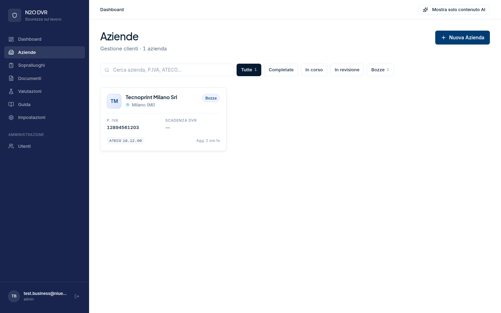

La nuova azienda compare come tessera nell'elenco, inizialmente nello stato **Bozza**.

### 3. Compila il sopralluogo in 7 passaggi

Apri la scheda dell'azienda e clicca **Inizia Sopralluogo** in alto a destra. Il wizard ti guida attraverso 7 passaggi numerati: Dati Azienda, Persone, Ambienti, Attrezzature, Valutazione Rischi, Sostanze Chimiche, Riepilogo.

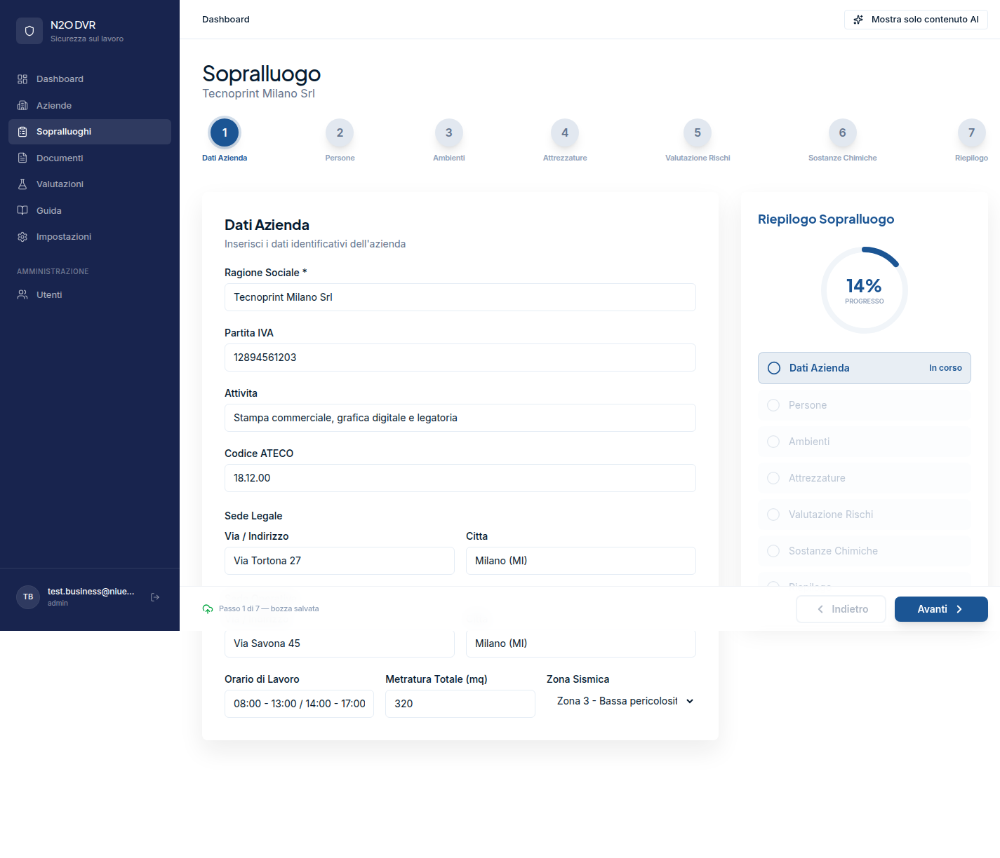

Il progresso è visibile a destra (grafico percentuale) e in basso (indicatore *"Passo X di 7 — bozza salvata"*). Puoi uscire e riprendere in qualsiasi momento: i dati si salvano automaticamente passando da un passo all'altro.

> Il dettaglio di ogni singolo passaggio è nella sezione **[Sopralluoghi](#sopralluoghi)**.

### 4. Genera i documenti

Al termine del sopralluogo, apri la scheda azienda e clicca **Genera Documenti** in alto a destra (oppure vai in **Documenti** dal menu laterale e seleziona l'azienda). Puoi generare tutti i documenti compatibili con un click, o scegliere i singoli documenti da produrre.

La generazione della maggior parte dei documenti richiede tra i 30 e i 90 secondi. Lo stato di ciascuna tessera passa da **In attesa** a **In generazione** (con spinner) fino a **Pronto**.

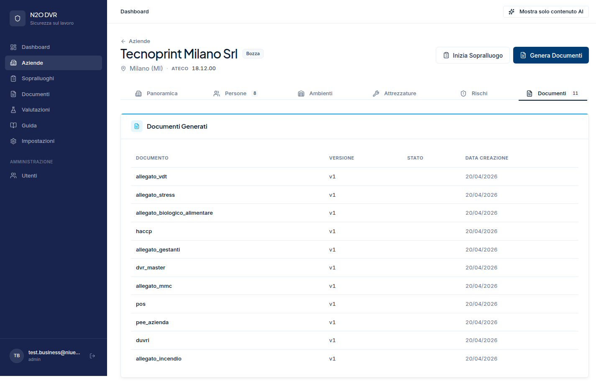

### 5. Revisiona in Google Docs

Sulla tessera del DVR Master (quando in stato **Pronto**), clicca **Modifica in Google Docs**. La piattaforma converte il documento e lo apre in una nuova scheda del browser.

Modifica liberamente. Al termine, torna sulla piattaforma: vedrai comparire i pulsanti **Scarica modifiche** e **Scarta**.

### 6. Scarica la versione definitiva

Una volta completata la revisione, clicca **Scarica modifiche**: la piattaforma sincronizza il Google Doc e crea una **nuova versione** del DVR. Clicca poi **Scarica** per ottenere il file `.docx` finale.

---

## Guida per funzione

### Dashboard

La **Dashboard** è la schermata iniziale dopo il login. Mostra in un colpo d'occhio lo stato della tua attività.

Elementi principali:

- **5 KPI** in alto: Clienti attivi, Sopralluoghi in corso, Sopralluoghi completati, Bozze, Scadenze imminenti.
- **Alert di sorveglianza sanitaria** (se presenti) — avvisi per videoterminalisti.
- **Tabella Aziende Clienti** con ricerca, ordinamento e badge di stato (Bozza / In corso / Completato).
- Colonna **Scadenza DVR**: i chip cambiano colore in base ai giorni mancanti (rosso ≤ 7 giorni, giallo ≤ 30 giorni).

Gli amministratori vedono inoltre il pulsante **Aggiungi cliente** in alto a destra.

Il toggle **Mostra solo contenuto AI** in alto a destra filtra le sezioni con contenuto generato da AI: utile per isolare ciò che richiede una revisione umana.

### Aziende

L'area **Aziende** è il registro anagrafico dei clienti.

**Elenco**

Griglia di tessere aziendali con ragione sociale, stato sopralluogo, città, codice ATECO, data di aggiornamento e — se presente — la scadenza del DVR. I filtri in alto (Tutte / Completate / In corso / In revisione / Bozze) permettono di restringere la vista.

In alto a destra il pulsante **Nuova Azienda** (visibile solo agli admin).

**Nuova Azienda** (solo admin)

Form diviso in sezioni:

- **Dati Azienda**: Ragione Sociale (obbligatoria), Partita IVA (11 cifre), Codice ATECO (formato `NN.NN.NN`), Attività.
- **Sede Legale** e **Sede Operativa**: indirizzo e città.
- **Orario di Lavoro**, **Metratura Totale (mq)**, **Zona Sismica** (1–4 con indicazione della pericolosità).

La validazione dei campi è istantanea: gli errori compaiono sotto il campo al blur.

**Scheda Azienda**

Cliccando su una tessera si apre la scheda dell'azienda. Subito sotto l'header trovi 6 tab: **Panoramica, Persone, Ambienti, Attrezzature, Rischi, Documenti**.

1. **Panoramica** — dati anagrafici, sedi, descrizione attività. Il box **Descrizione** permette di caricare una visura camerale o generare automaticamente la descrizione con AI (i dati personali vengono redatti prima dell'invio all'AI).
2. **Persone** — tabella con nominativo, mansione, tipologia contrattuale, sesso, ruoli (DdL, RSPP, RLS, Preposto, Primo Soccorso, Antincendio).
3. **Ambienti** — locali con tipo, superficie, attività.
4. **Attrezzature** — attrezzature con marcatura CE e stato verifiche periodiche.
5. **Rischi** — elenco rischi raggruppati per categoria, con indice I e livello (Accettabile, Modesto, Grave, Gravissimo).
6. **Documenti** — tutte le versioni generate, con versione, stato e data.

In alto a destra sono sempre disponibili:

- **Inizia Sopralluogo** — apre il questionario.
- **Genera Documenti** — porta alla pagina Documenti già filtrata per questa azienda.

Una volta compilato il sopralluogo, la panoramica espone tutti i dati in forma di schede informative:

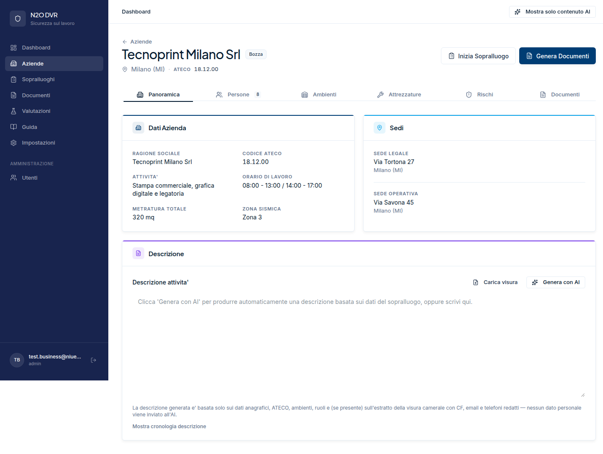

### Sopralluoghi

Il **Sopralluogo** è il cuore della piattaforma: un questionario digitale in 7 passaggi che sostituisce l'inserimento manuale dei dati nel DVR.

**Selezione azienda**

Entrando in **Sopralluoghi**, scegli l'azienda dal menu a tendina oppure cliccala dalla griglia. Ogni tessera mostra anche la data dell'ultima modifica.

**Struttura del wizard**

Ogni passaggio mostra:

- Sulla sinistra, il **contenuto editabile** del passaggio (form o tabelle).
- Sulla destra, il **Riepilogo Sopralluogo** con grafico di progresso percentuale e checklist dei 7 passaggi (spuntati a mano a mano che li completi).
- In basso, l'indicatore *"Passo X di 7 — bozza salvata"* (l'icona nuvola è verde quando il salvataggio è andato a buon fine) e i pulsanti **Indietro** / **Avanti**.

**Ciclo di vita del sopralluogo**

| Stato | Significato |
|-------|-------------|
| `draft` | Bozza, in compilazione |
| `firmato` | Cliente ha firmato digitalmente |
| `in_revisione` | Revisione post-firma aperta |
| `completed` | Sopralluogo chiuso definitivamente |

Quando il sopralluogo è **firmato**, il wizard blocca la navigazione (eccetto il Riepilogo) e mostra il timestamp della firma. Il pulsante **Apri revisione** sblocca temporaneamente i passi per correzioni.

Di seguito i 7 passaggi in dettaglio.

#### Passo 1 — Dati Azienda

Inserisci i dati identificativi dell'azienda: Ragione Sociale (obbligatoria), Partita IVA, Attività, Codice ATECO, indirizzo e città delle due sedi, orario di lavoro, metratura totale e zona sismica.

Se l'azienda esiste già nel registro, i campi sono pre-compilati: puoi correggerli qui e le modifiche si propagano alla scheda azienda.

#### Passo 2 — Persone

Gestisci l'elenco dei dipendenti e i relativi ruoli di sicurezza. Clicca **Aggiungi persona** per inserire un nominativo; per ogni persona puoi specificare mansione, tipologia contrattuale, sesso, ambienti assegnati e i ruoli (DdL, RSPP, RLS, Preposto, Primo Soccorso, Antincendio).

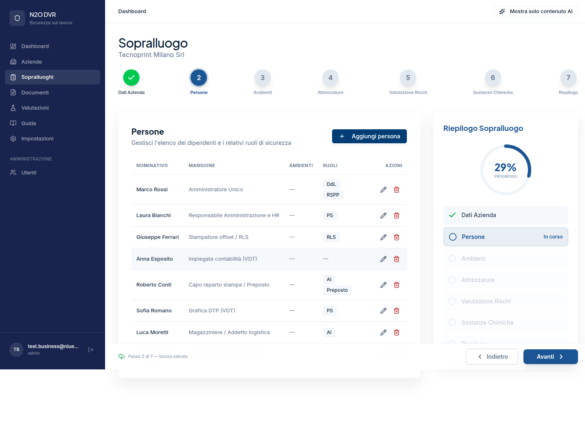

Le icone matita e cestino in fondo a ogni riga permettono di modificare o rimuovere la persona.

> **Requisito**: serve almeno un **RSPP** assegnato per completare il sopralluogo.

#### Passo 3 — Ambienti

Definisci gli ambienti di lavoro dell'azienda: uffici, officine, magazzini, spogliatoi, laboratori, cucine. Per ciascuno inserisci nome, tipo (Ufficio / Officina / Magazzino / Bagno-Spogliatoio / Laboratorio / Altro), superficie in mq e una descrizione delle attività svolte.

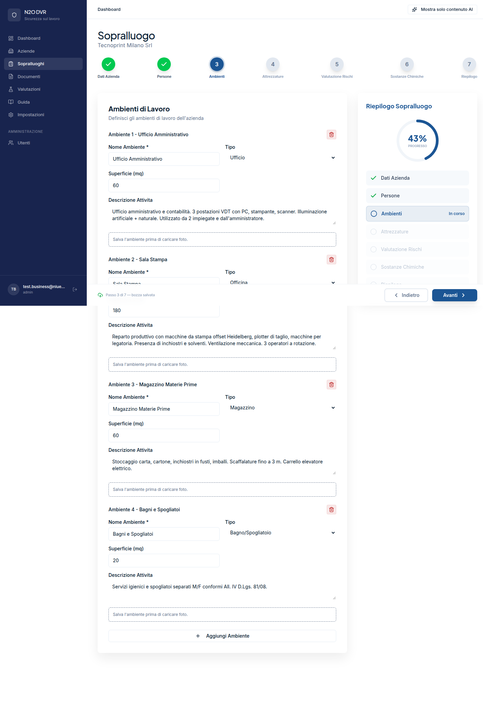

Il tipo di ambiente determina le attrezzature suggerite al Passo 4 e i rischi di default al Passo 5.

> **Requisito**: almeno **1 ambiente** per completare il sopralluogo.

#### Passo 4 — Attrezzature

Il passo Attrezzature è condiviso tra tutti gli ambienti: selezioni un ambiente in alto e vedi le attrezzature suggerite per quel tipo; le scelte restano disponibili anche negli altri ambienti.

**Selezione ambiente**

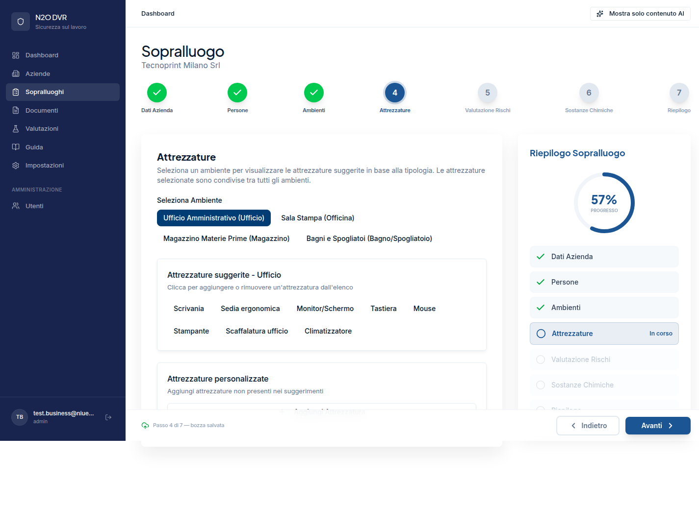

In alto, i chip corrispondono agli ambienti definiti al Passo 3. Il chip attivo è quello di cui stai visualizzando le attrezzature suggerite.

**Attrezzature suggerite**

La libreria propone attrezzature tipiche in base al tipo di ambiente: cliccando un chip, lo aggiungi (il chip diventa pieno). Clicca di nuovo per rimuoverlo.

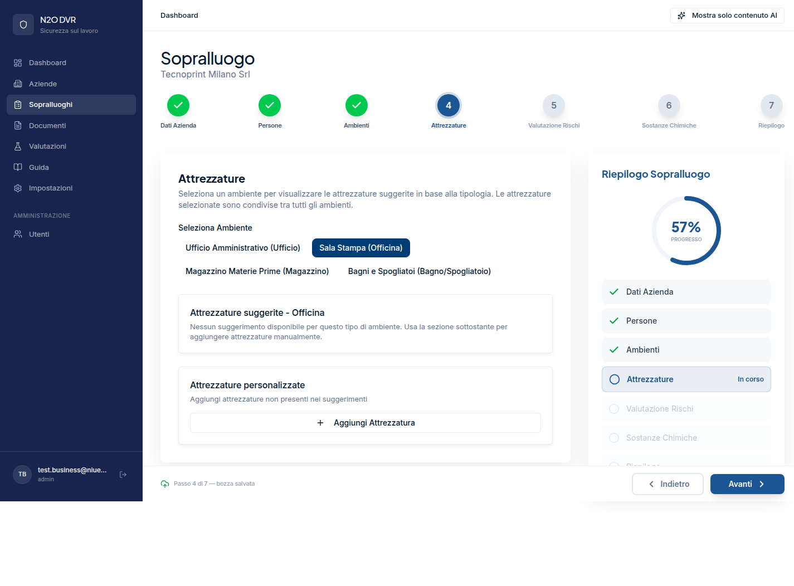

Per alcuni tipi di ambiente (es. **Officina**) la libreria potrebbe essere vuota; in tal caso vedrai il messaggio *"Nessun suggerimento disponibile per questo tipo di ambiente"* e potrai procedere con il box personalizzate.

**Attrezzature personalizzate**

Il box **Attrezzature personalizzate** consente di aggiungere macchinari specifici non presenti nei suggerimenti: nome, marcatura CE, verifiche periodiche.

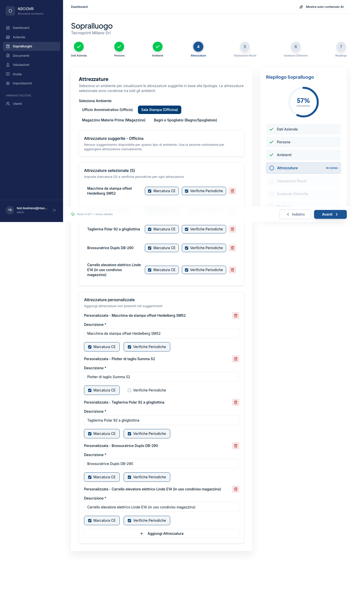

Ogni attrezzatura compare in una card con i flag **CE** e **Verifiche** e i tasti di modifica/eliminazione.

#### Passo 5 — Valutazione Rischi

Qui valuti i rischi per ogni ambiente. Il passo è il più denso: per ciascun ambiente vedi un pannello con ~11 categorie di rischio (Strutture, Macchine, Elettrico, Chimico, Biologico, Incendio, Rumore, Microclima, Organizzazione, Psicologico, Ergonomia).

**Seleziona ambiente**

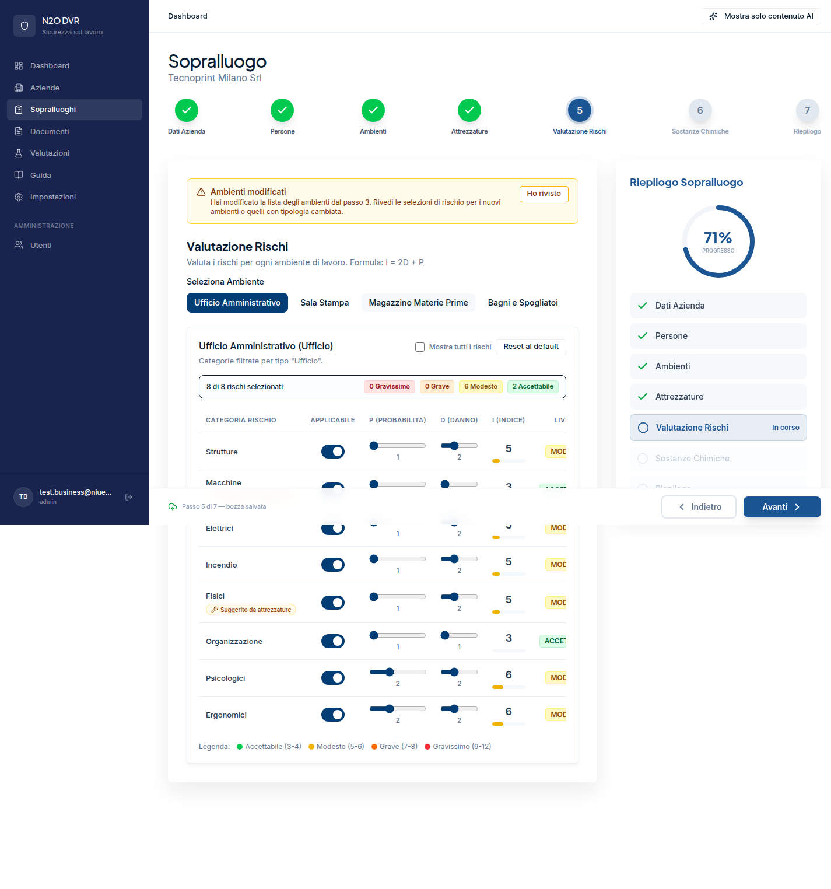

Clicca il chip dell'ambiente per filtrare la tabella dei rischi. Un alert giallo *"Ambienti modificati"* compare se gli ambienti sono stati aggiornati dopo la prima valutazione: ti invita a rivedere i rischi.

**Valori P e D per categoria**

Per ogni categoria imposti:

- **P** (Probabilità), 1–4
- **D** (Danno), 1–4

L'indice **I = 2·D + P** viene calcolato automaticamente (range 3–12) e la pill colorata a destra mostra il livello risultante:

- **Accettabile** (verde): 3–4
- **Modesto** (giallo): 5–6
- **Grave** (arancio): 7–8
- **Gravissimo** (rosso): 9–12

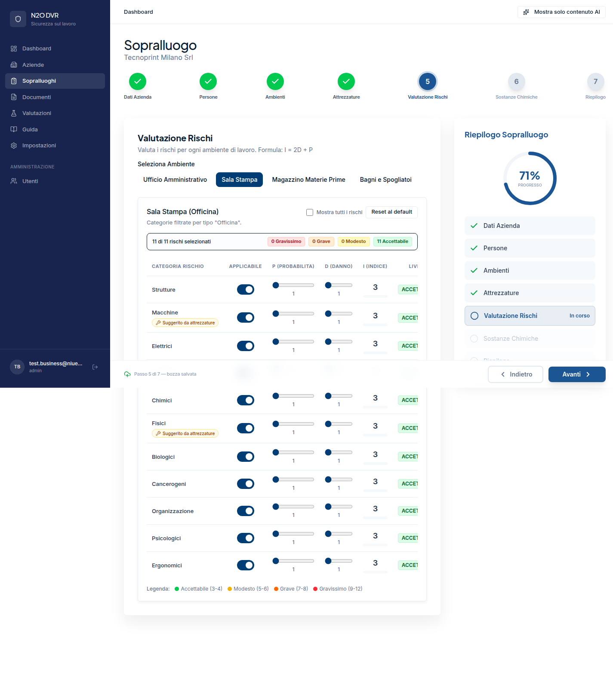

Le categorie non pertinenti all'ambiente possono essere disattivate con il toggle a sinistra. Il pulsante **Reset a default** ripristina i valori iniziali suggeriti per il tipo di ambiente.

**Regola P e D per scenari realistici**

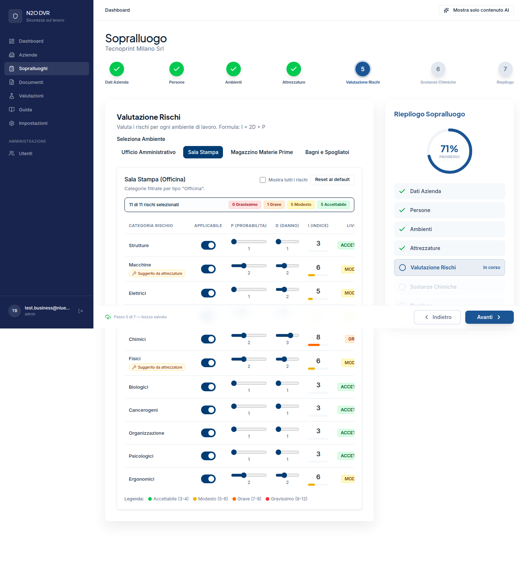

Alza i valori P/D dove serve: i chip colorati si aggiornano in tempo reale, così puoi bilanciare la valutazione a vista.

#### Passo 6 — Sostanze Chimiche

Il passo consente di censire le sostanze pericolose presenti in azienda. Puoi procedere in due modi: **upload AI dei PDF SDS** o **inserimento manuale**.

**Stato iniziale**

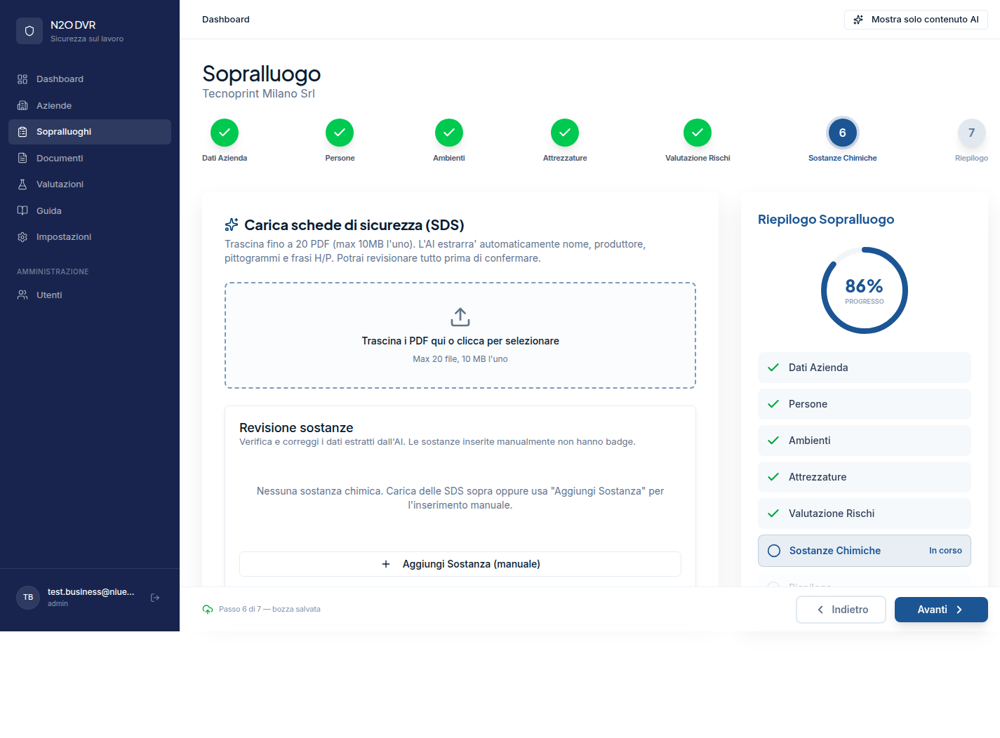

In alto trovi il box di upload **Carica schede di sicurezza (SDS)** con drag-and-drop; sotto, il pulsante **Aggiungi sostanza manuale**.

**Inserimento manuale**

Cliccando **Aggiungi sostanza manuale** si apre un form con: Nome prodotto, Produttore, Stato/Miscela, Pittogrammi GHS, Frasi H (pericolo), Frasi P (prudenza).

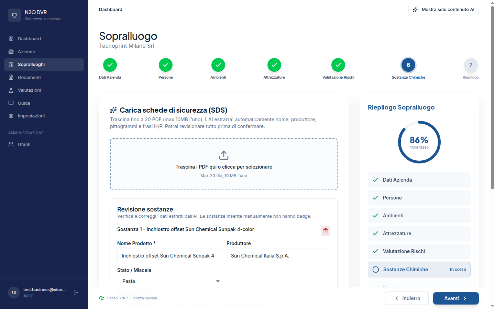

I pittogrammi GHS sono selezionabili dalla griglia (GHS01–GHS09). Le frasi H e P si aggiungono come chip.

**Upload PDF con estrazione AI**

Trascina fino a **20 PDF** (max 10 MB l'uno) nell'area di upload. L'AI estrae automaticamente nome, produttore, pittogrammi e frasi H/P. Il badge verde **AI SDS** sulla tessera conferma che i dati provengono da estrazione AI.

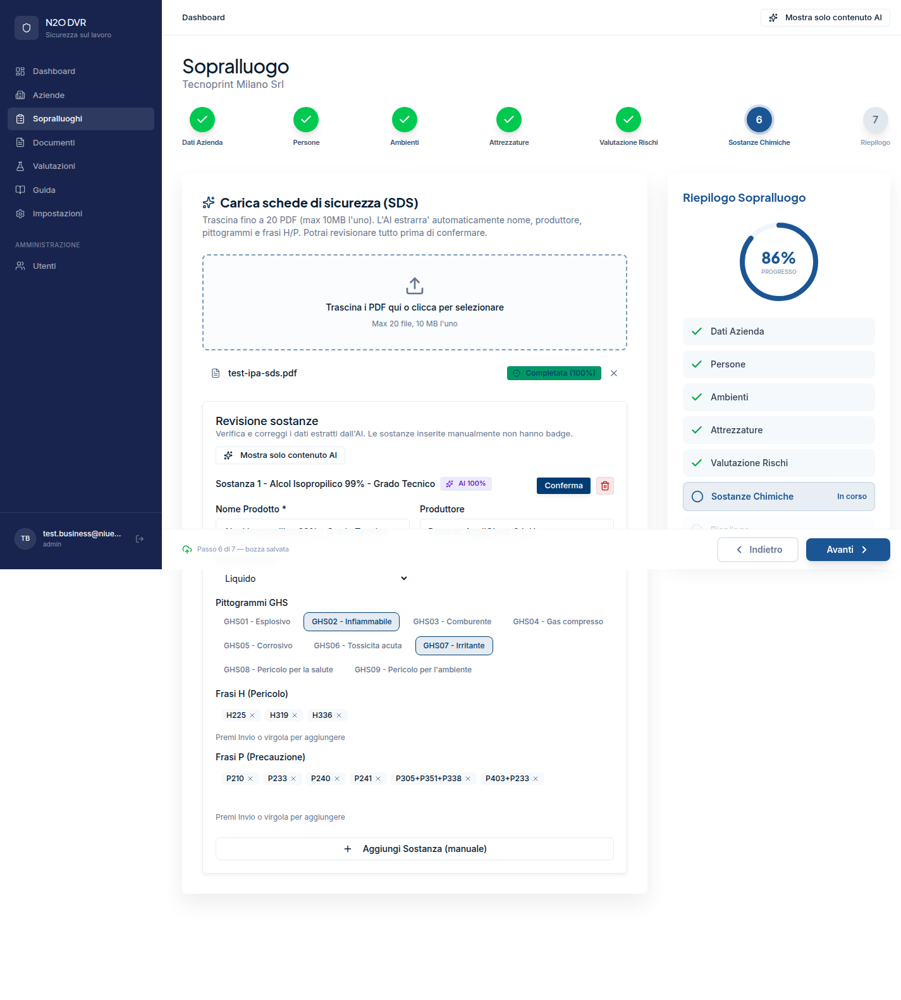

Ogni sostanza estratta deve essere **revisionata e confermata** prima di proseguire (pulsante **Conferma**). Il badge diventa **AI SDS · Confermato** dopo la review.

**Sostanze complete**

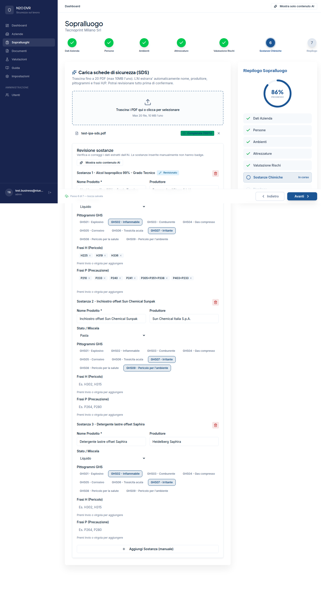

L'elenco mostra tutte le sostanze censite con i relativi pittogrammi, frasi H/P e la provenienza (AI o manuale).

> **Privacy**: l'AI riceve solo il file PDF dell'SDS. Non vengono inviati dati personali di dipendenti o azienda.

#### Passo 7 — Riepilogo e Firma

L'ultimo passo mostra una vista consolidata di tutto ciò che hai inserito, raggruppato per sezioni: Dati Azienda, Persone, Ambienti, Attrezzature, Valutazione Rischi, Sostanze Chimiche, Firma del Cliente.

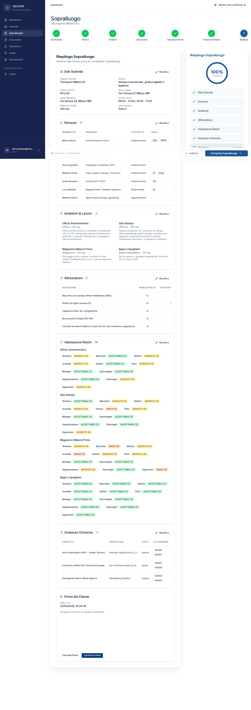

Ogni sezione ha un pulsante **Modifica** che ti riporta al passaggio corrispondente per correggere eventuali dati.

**Firma del cliente**

In fondo alla pagina è presente l'area firma: il cliente firma digitalmente (con mouse o touch) e clicca **Conferma firma**. Il pulsante **Cancella firma** consente di ricominciare.

**Sopralluogo completato**

Dopo la firma, lo stato del sopralluogo cambia in **Completato** e viene mostrato il timestamp della firma.

Da questo momento il wizard è bloccato in sola lettura. Per correggere dati dopo la firma, usa **Apri revisione**.

### Documenti

L'area **Documenti** è dove generi i documenti di sicurezza veri e propri. Ci sono **17 tipi di documento** disponibili, divisi tra DVR, allegati e documenti complementari.

**Due punti di accesso**

Puoi aprire la pagina Documenti in due modi:

- **Da una scheda azienda**, cliccando **Genera Documenti** in alto a destra — la pagina si apre già filtrata sull'azienda selezionata.
  
- **Dal menu laterale → Documenti**, e poi scegliendo l'azienda dal selettore in alto.

La scheda azienda ha inoltre un tab **Documenti** dedicato che mostra la lista delle versioni generate (inizialmente vuota):

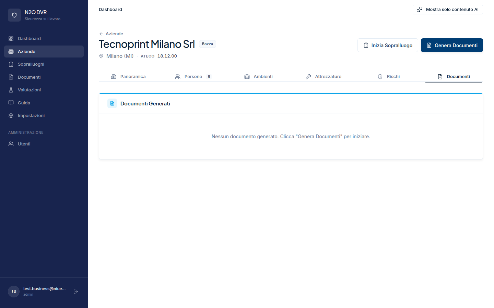

**Dialogo "Genera Documenti"**

Cliccando **Genera Documenti** o **Genera Tutti** si apre un dialogo a schede che elenca i documenti disponibili raggruppati per categoria (Documenti principali, Allegati DVR, Piani di emergenza, HACCP, Appalti e cantieri).

Ogni tessera ha una checkbox e mostra:

- Categoria (badge colorato)
- Complessità (Bassa / Media / Alta)
- Pagine stimate

Puoi usare **Seleziona tutti** / **Deseleziona tutti** oppure spuntare singolarmente. Conferma con **Genera (X)** — parte la generazione in background.

**Stato durante la generazione**

Subito dopo aver cliccato Genera, la tessera di ciascun documento passa allo stato **In generazione** con spinner.

La maggior parte dei documenti completa in 30–60 secondi. Documenti più complessi (DVR Master, POS, HACCP) possono richiedere fino a 2 minuti. La pagina si aggiorna automaticamente: non è necessario ricaricare manualmente.

**Stato finale**

Quando la generazione completa, la tessera passa a **Pronto** (verde) e mostra versione (es. v1), data, "Generato da [nome]" e i pulsanti **Rigenera**, **Scarica**, **Modifica in Google Docs** (solo DVR Master), **Storia**.

**Legenda stati**

- **In attesa** — non ancora generato
- **In generazione** — generazione in corso (con spinner)
- **Pronto** — documento generato con successo
- **Bozza** — generato ma con warning, è possibile **Riprova**
- **Errore** — generazione fallita (passa il mouse sulla tessera per leggere il messaggio)

**Pulsanti per stato**

- **Genera** (nessuna versione esistente)
- **Rigenera** (ricrea da zero una nuova versione)
- **Riprova** (se in stato bozza)
- **Scarica** (disponibile quando pronto)
- **Storia (vN)** — apre il modale con lo storico versioni

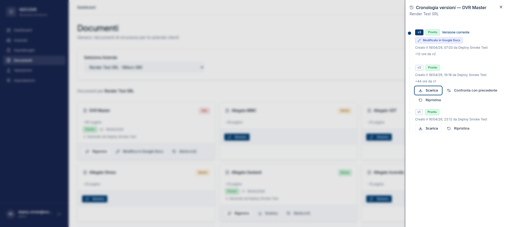

**Dipendenze tra documenti**

Il **PEE Aziendale** e il **PEE Edificio/Comune** non si possono generare finché il DVR Master non è pronto. Le tessere appaiono disattivate con la scritta *"Genera prima il DVR Master"*.

**Vista globale documenti**

Dal menu laterale → **Documenti**, puoi anche scegliere l'azienda dal selettore in alto e ottenere una vista compatta di tutti i documenti per quell'azienda:

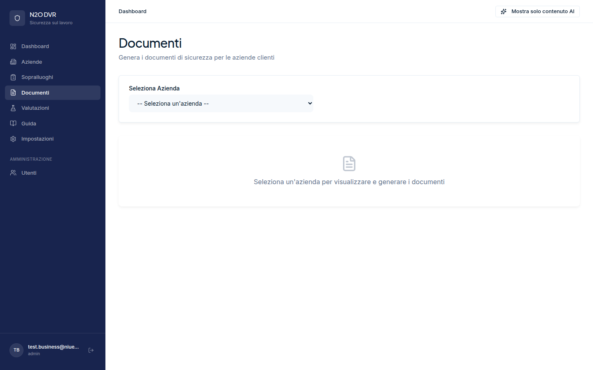

La vista completa con tutte le categorie è ottima per avere un colpo d'occhio su cosa è stato generato e cosa manca:

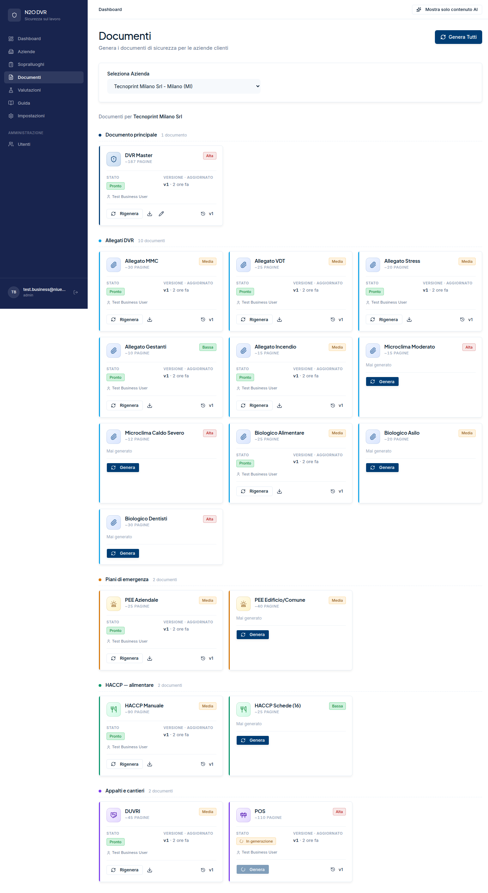

**Modifica in Google Docs (solo DVR Master)**

Quando il DVR Master è **Pronto**, sulla tessera compare **Modifica in Google Docs**. Il flusso è questo:

1. Clic su **Modifica in Google Docs** → toast *"Conversione in Google Docs in corso..."* (2–5 secondi).
2. Si apre una nuova scheda con il documento modificabile in Google Docs.

   

3. Tornando sulla piattaforma, la tessera ora mostra i pulsanti **Scarica modifiche** e **Scarta**.

   

- **Scarica modifiche** → sincronizza il Google Doc, crea la versione successiva (v2, v3...) e mostra toast *"Nuova versione v[N] creata"*. La tessera si aggiorna con la nuova versione.

  

- **Scarta** → apre un dialogo di conferma:

  

  > *"Scartare le modifiche? Le modifiche nel Google Doc verranno eliminate definitivamente. Questa azione non può essere annullata."*

  Dopo **Scarta**, il Google Doc viene rimosso e i pulsanti spariscono: potrai eventualmente riaprirne uno nuovo con **Modifica in Google Docs**.

**HACCP Schede (16)**

Cliccando **Genera** su *HACCP Schede* si apre un dialogo con le 16 schede (SA-01 … SA-16), tutte pre-selezionate. Puoi:

- Usare **Seleziona tutte** / **Deseleziona tutte**.
- Spuntare singolarmente quali includere.
- Confermare con **Genera (X)** — produce un archivio `.zip` con le schede scelte.

### Valutazioni

L'area **Valutazioni** raccoglie 11 tipologie di valutazione specifica accessibili dal selettore azienda:

1. **MMC** — Movimentazione Manuale dei Carichi (metodo NIOSH, UNI EN ISO 11228).
2. **VDT** — Videoterminali (D.Lgs. 81/2008, Titolo VII).
3. **Stress Lavoro-Correlato** — Metodo INAIL.
4. **Rischio Incendio** — D.M. 03/09/2021.
5. **Microclima** — UNI EN ISO 7730 / 7933.
6. **Rischio Biologico** — D.Lgs. 81/2008, Titolo X.
7. **Gestanti, Puerpere, Allattamento** — D.Lgs. 151/2001.
8. **POS** — Piano Operativo di Sicurezza (cantieri).
9. **DUVRI** — Rischi da interferenza.
10. **PEE** — Piano di Emergenza ed Evacuazione.
11. **HACCP** — Sicurezza alimentare (Reg. CE 852/2004).

Ogni tessera apre il modulo di valutazione dedicato, con input specifici e calcolo automatico degli indici pertinenti. Queste valutazioni alimentano i relativi allegati nel DVR.

### Impostazioni

L'area **Impostazioni** contiene:

- **Profilo** — attualmente in fase di sviluppo (*"Le impostazioni del profilo saranno disponibili a breve"*).
- **Backup & ripristino** (solo admin) — stato del backup, cronologia eventi, link alla dashboard Render per point-in-time recovery.
- **Feedback AI** (solo admin) — vedi sezione Amministrazione.

---

## Amministrazione (solo admin)

Questa sezione è visibile solo agli utenti con ruolo **admin**.

### Gestione utenti

Dal menu laterale, nella sezione *Amministrazione*, trovi **Utenti**.

**Tabella Team**

Elenco degli utenti dell'organizzazione con: Nome, Email, Ruolo (Admin / Operatore ufficio / Operatore campo), data di creazione, pulsanti **Modifica** e **Password**.

**Tabella Attività per utente**

Per ogni utente vedi il numero di **Clienti creati** e **Documenti generati** (dati raccolti a partire dalla data di primo rilascio della funzione).

**Aggiungi utente**

Pulsante **Aggiungi utente** in alto a destra → apre il dialogo *Aggiungi utente*:

- Nome completo (obbligatorio)
- Email (obbligatoria)
- Password iniziale (min. 8 caratteri — da comunicare manualmente all'utente)
- Ruolo

Conferma con **Crea utente**.

**Modifica utente**

Permette di cambiare nome e ruolo. L'email non è modificabile.

**Reimposta password**

Inserisci la nuova password (min. 8 caratteri). Dopo il salvataggio vedrai un banner verde *"Password aggiornata. Consegnala all'utente."*: comunicala manualmente al destinatario.

### AI feedback

Il pannello **Feedback AI** (accessibile da *Impostazioni → Apri pannello feedback AI* o direttamente da `/admin/ai-feedback`) raccoglie le reazioni degli operatori ai suggerimenti AI (misure suggerite, descrizioni azienda, estrazione SDS).

- **KPI**: Rifiuti totali, Accettazioni totali, Tipi di superficie.
- **Rifiuti per superficie AI** — tabella con rapporto di rifiuto per ciascun tipo di suggerimento.
- Toggle **Rifiuti** / **Accettazioni** per vedere gli ultimi 50 feedback con preview del contenuto.

Serve per monitorare la qualità dei prompt AI nel tempo e intervenire se un tipo di suggerimento ha troppe bocciature.

---

## FAQ e risoluzione problemi

**Non riesco ad accedere: "Credenziali non valide"**
Verifica email e password. Se il problema persiste, chiedi all'amministratore di reimpostare la password dal pannello **Utenti**.

**Il documento non si genera, resta "In attesa" a lungo**
La generazione può richiedere fino a 2 minuti per documenti di alta complessità (DVR Master, POS, HACCP). Se dopo 3 minuti lo stato non cambia, ricarica la pagina. Se finisce in **Errore**, leggi il messaggio al passaggio del mouse sulla tessera; spesso l'errore è un campo obbligatorio mancante nel sopralluogo.

**Voglio rigenerare un documento da zero**
Clicca **Rigenera** sulla tessera. Verrà creata una nuova versione; le versioni precedenti restano accessibili dal pulsante **Storia**.

**Google Docs non si apre / restituisce errore**
Assicurati che l'account Google utilizzato dalla piattaforma abbia accesso alla cartella Drive di progetto. Se il problema persiste, segnala all'amministratore: potrebbe essere scaduto il token di autorizzazione.

**Ho modificato il Google Doc ma non vedo "Scarica modifiche"**
Ricarica la pagina Documenti. Se la tessera non mostra i pulsanti di sync, verifica che il Google Doc sia stato effettivamente aperto dalla piattaforma (non da un link incollato).

**Ho cliccato "Scarta" per errore**
Le modifiche nel Google Doc sono perdute in modo irreversibile. Le versioni precedentemente sincronizzate sul server sono ancora disponibili dal pulsante **Storia**; puoi ripartire da una di quelle con **Modifica in Google Docs**.

**Il PEE non si può generare**
È una dipendenza voluta: il PEE usa i dati del DVR Master. Genera prima il DVR Master (deve essere in stato **Pronto**) e poi il PEE.

**Il sopralluogo è firmato ma devo correggere un dato**
Usa il pulsante **Apri revisione** nel passo Riepilogo. Questo sblocca temporaneamente il wizard; al termine della correzione, richiedi una nuova firma.

**Le attrezzature del Passo 4 non compaiono nel DVR**
Verifica che ogni attrezzatura abbia almeno il nome compilato e che tu sia andato avanti fino al Riepilogo (il salvataggio avviene ad ogni avanzamento). Se permangono vuoti in DVR, apri la Scheda Azienda → tab **Attrezzature** e verifica che l'elenco sia popolato.

**L'AI ha estratto dati sbagliati da un SDS**
Apri la tessera della sostanza nel Passo 6, correggi manualmente i campi e clicca **Conferma**. Se l'errore è sistematico (stesso tipo di SDS, stesso errore), segnalalo all'admin: il feedback AI viene raccolto per migliorare i prompt.

**Il toggle "Mostra solo contenuto AI" cosa filtra?**
Nasconde le sezioni/campi generati senza intervento AI e mostra solo ciò che è stato prodotto dall'AI (descrizioni, misure correttive suggerite, estrazione SDS). Serve quando vuoi rivedere rapidamente tutti i contributi AI della piattaforma.

---

## Glossario

| Termine | Significato |
|---------|-------------|
| **DVR** | Documento di Valutazione dei Rischi — documento principale, ~187 pagine |
| **MMC** | Movimentazione Manuale dei Carichi — valutazione con metodo NIOSH |
| **VDT** | Videoterminali — valutazione postazioni di lavoro al computer |
| **SDS / SdS** | Scheda di Sicurezza — documentazione delle sostanze chimiche |
| **PEE** | Piano di Emergenza ed Evacuazione |
| **DUVRI** | Documento Unico di Valutazione dei Rischi da Interferenze (appalti) |
| **POS** | Piano Operativo di Sicurezza — cantieri temporanei o mobili |
| **HACCP** | Hazard Analysis Critical Control Points — sicurezza alimentare |
| **RSPP** | Responsabile del Servizio di Prevenzione e Protezione |
| **RLS** | Rappresentante dei Lavoratori per la Sicurezza |
| **DdL** | Datore di Lavoro |
| **D.Lgs. 81/2008** | Testo Unico sulla Sicurezza sul Lavoro — legge italiana di riferimento |
| **Indice I** | Indice di rischio calcolato come `I = 2·D + P` (Danno × 2 + Probabilità) |
| **NIOSH** | National Institute for Occupational Safety and Health — metodo per MMC |
| **GHS** | Globally Harmonized System — pittogrammi di pericolo per le sostanze chimiche |
| **Frasi H / P** | Hazard / Precautionary statements — codici standardizzati per pericoli e precauzioni SDS |

---

## Contatti e supporto

- **Realizzazione piattaforma**: Niuexa — Gregor Maric (CTO), [ai@niuexa.ai](mailto:ai@niuexa.ai)
- **Committente**: N2O SRL — Luca Marchetti e team
- **Segnalazione bug e richieste**: contatta l'amministratore della tua organizzazione, che inoltrerà a Niuexa.

---

*Ultima revisione: 2026-04-21*
