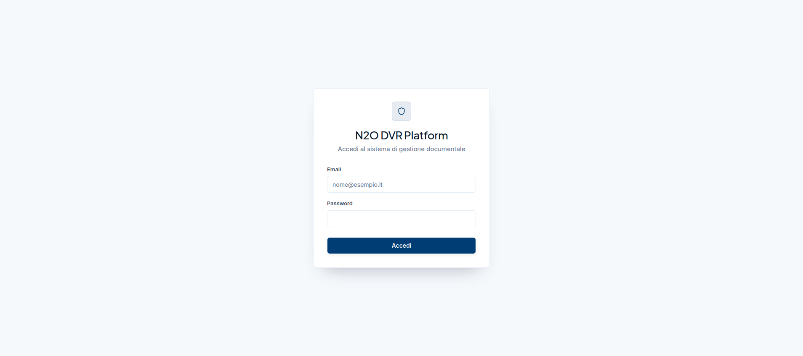
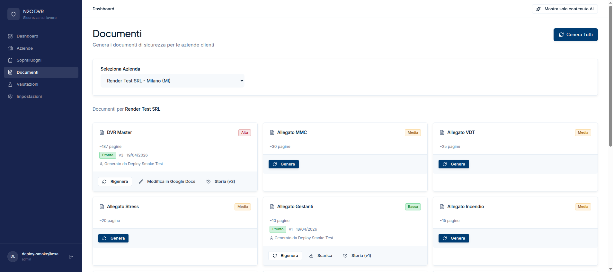
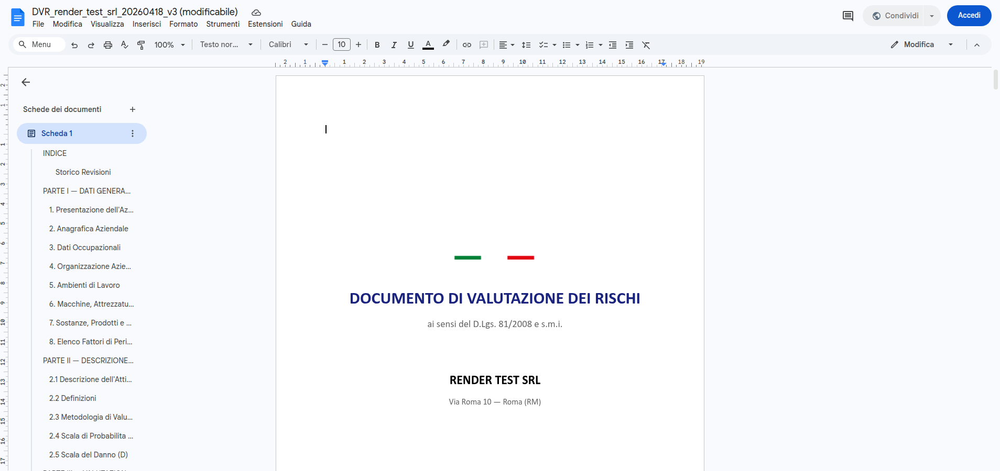
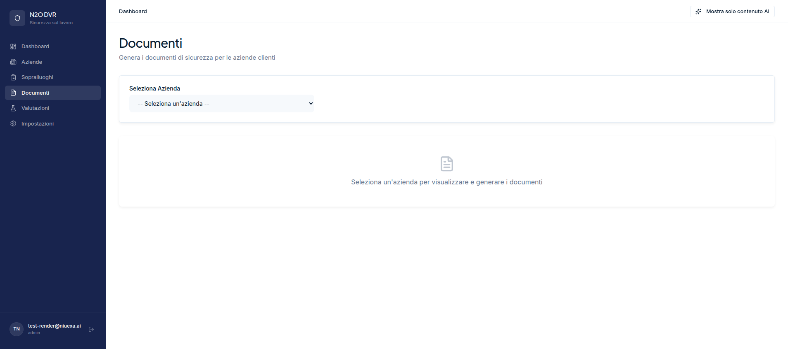
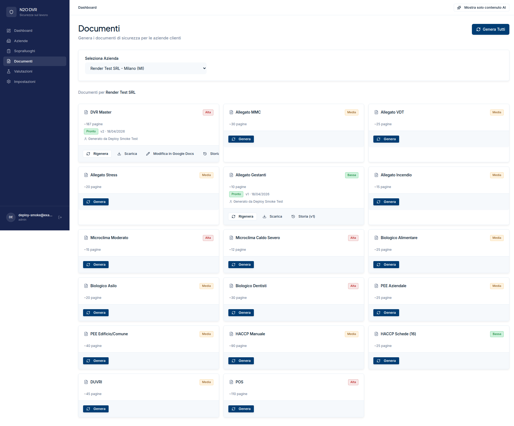
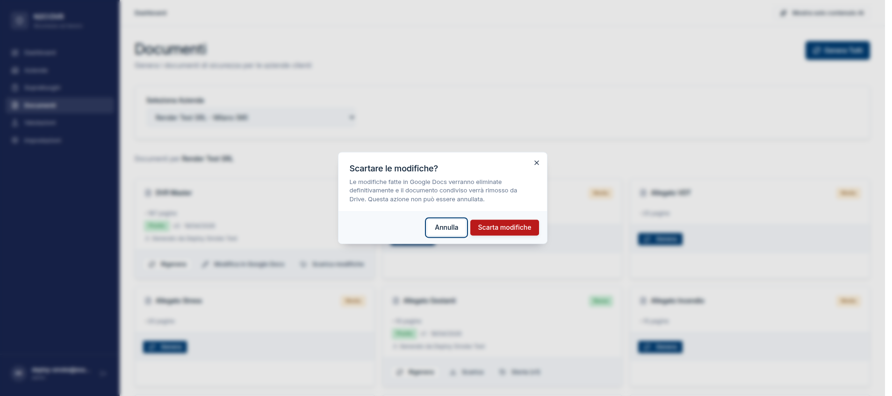

# Guida Utente — N2O DVR

Benvenuti nella piattaforma **N2O DVR**, il sistema per la generazione automatizzata dei documenti di sicurezza sul lavoro (DVR Master e allegati). Questa guida è pensata per operatori di campo, operatori d'ufficio e amministratori. Il principio alla base della piattaforma è semplice: **il vostro lavoro deve essere di revisione, non di inserimento manuale del dato**.

## Introduzione

La piattaforma permette di:

- Gestire l'anagrafica dei clienti (**Aziende**).
- Raccogliere i dati del sopralluogo attraverso un questionario digitale in 7 passaggi.
- Generare automaticamente il **DVR Master** (~187 pagine) e i suoi allegati (MMC, VDT, Stress, Incendio, Microclima, Biologico, Gestanti).
- Produrre i documenti complementari (PEE, HACCP, DUVRI, POS).
- Revisionare il DVR direttamente in **Google Docs** e riportare le modifiche come nuova versione.
- Scaricare tutti i documenti in formato `.docx`.

Tutto l'output è in italiano e conforme al **D.Lgs. 81/2008** e alle norme tecniche collegate.

---

## Quick Start — Primo utilizzo in 10 minuti

Il percorso tipico per generare il primo DVR è questo.

### 1. Accedi alla piattaforma

Apri l'URL della piattaforma, inserisci **email** e **password** che ti sono state comunicate e clicca **Accedi**.

Se ricevi l'errore "Credenziali non valide", controlla di aver digitato correttamente e, in caso, contatta l'amministratore per il reset password.

### 2. Crea la tua prima azienda

Dal menu laterale, clicca su **Aziende**, poi in alto a destra su **Nuova Azienda** (visibile solo agli amministratori).

Compila almeno:

- **Ragione Sociale** (obbligatoria)
- **Partita IVA**
- **Codice ATECO**
- Attività, sedi, orario di lavoro, metratura, zona sismica

Clicca **Salva Azienda**. L'azienda comparirà nell'elenco.

### 3. Compila il sopralluogo

Dal menu laterale, vai in **Sopralluoghi**, seleziona l'azienda appena creata e avvia il questionario.

Il sopralluogo è diviso in 7 passaggi:

1. **Dati Azienda** — dati identificativi, descrizione, contesto territoriale
2. **Persone** — dipendenti, mansioni, ruoli (DdL, RSPP, RLS, ecc.)
3. **Ambienti** — locali, superficie, attività svolte
4. **Attrezzature** — macchinari, marcatura CE, verifiche periodiche
5. **Valutazione Rischi** — rischi individuati con indice `I = 2·D + P`
6. **Sostanze Chimiche** — Schede di Sicurezza (SDS)
7. **Riepilogo** — verifica finale e firma cliente

I dati vengono salvati automaticamente passando da un passo all'altro. Puoi tornare indietro in qualsiasi momento con il pulsante **Indietro**.

### 4. Genera il DVR Master

Quando il sopralluogo è completo, vai in **Documenti**, seleziona l'azienda e clicca **Genera** sulla tessera **DVR Master**. La generazione richiede in genere 30-90 secondi; durante il processo lo stato passa a **In generazione**.

Quando lo stato diventa **Pronto**, puoi già scaricare il `.docx` o procedere con la revisione in Google Docs.

### 5. Revisiona in Google Docs

Sulla tessera del DVR Master, clicca **Modifica in Google Docs**. La piattaforma converte il documento in un Google Doc e lo apre in una nuova scheda.

Puoi modificare liberamente. Al termine, torna sulla piattaforma: vedrai comparire i pulsanti **Scarica modifiche** e **Scarta**.

### 6. Scarica la versione definitiva

Una volta completata la revisione, clicca **Scarica modifiche**: la piattaforma sincronizza il Google Doc e crea una **nuova versione** del DVR. Sulla tessera comparirà la pagina aggiornata (es. **v2**).

Clicca **Scarica** per ottenere il file `.docx` finale.

---

## Guida per funzione

### Dashboard

La **Dashboard** è la schermata iniziale dopo il login. Mostra:

- **5 KPI** in alto: Clienti attivi, Sopralluoghi in corso, Sopralluoghi completati, Bozze, Scadenze imminenti.
- **Alert di sorveglianza sanitaria** (se presenti) — avvisi per videoterminalisti.
- **Tabella Aziende Clienti** con ricerca, ordinamento e badge di stato (Bozza / In corso / Completato).
- Colonna **Scadenza DVR**: i chip cambiano colore in base ai giorni mancanti (rosso ≤7 giorni, giallo ≤30 giorni).

Gli amministratori vedono inoltre il pulsante **Aggiungi cliente** in alto a destra.

### Aziende

L'area **Aziende** è il registro anagrafico dei clienti.

**Elenco**

- Griglia di tessere aziendali con ragione sociale, stato sopralluogo, città e codice ATECO.
- Empty state con invito a creare la prima azienda (solo admin).

**Nuova Azienda** (solo admin)

Form diviso in sezioni:

- **Dati Azienda**: Ragione Sociale (obbligatoria), Partita IVA (11 cifre), Codice ATECO (formato `NN.NN.NN`), Attività.
- **Sede Legale** e **Sede Operativa**: indirizzo e città.
- **Orario di Lavoro**, **Metratura Totale (mq)**, **Zona Sismica** (1-4 con indicazione della pericolosità).

La validazione dei campi è istantanea: gli errori compaiono sotto il campo al blur.

**Scheda Azienda**

Cliccando su una tessera si apre la scheda dell'azienda con 6 tab:

1. **Panoramica** — dati anagrafici, sedi, descrizione (con editor AI).
2. **Persone** — tabella con nominativo, mansione, tipologia contrattuale, sesso, ruoli (DdL, RSPP, RLS, Preposto, Primo Soccorso, Antincendio).
3. **Ambienti** — locali con tipo, superficie, attività.
4. **Attrezzature** — attrezzature con marcatura CE e stato verifiche periodiche.
5. **Rischi** — elenco rischi raggruppati per categoria, con indice I e livello (Accettabile, Modesto, Grave, Gravissimo); misure correttive suggerite dall'AI.
6. **Documenti** — tutte le versioni generate, con stato, data e operatore.

In alto a destra della scheda sono sempre disponibili:

- **Inizia Sopralluogo** — apre il questionario.
- **Genera Documenti** — porta alla pagina Documenti già filtrata per questa azienda.

### Sopralluoghi

Il **Sopralluogo** è il cuore della piattaforma: un questionario digitale in 7 passaggi che sostituisce l'inserimento manuale dei dati nel DVR.

**Selezione azienda**

Entrando in **Sopralluoghi**, scegli l'azienda dal menu a tendina oppure cliccala dalla griglia. Ogni tessera mostra anche la data dell'ultima modifica.

**Wizard a 7 passaggi**

Il wizard procede passo-passo con icone e numeri. Ogni passaggio ha validazione: se mancano dati obbligatori (es. Ragione Sociale), un toast di errore lo segnala al tentativo di avanzamento.

**Salvataggio automatico**

I dati vengono inviati al server ad ogni passaggio. Puoi chiudere il browser e riprendere da dove avevi lasciato.

**Ciclo di vita del sopralluogo**

| Stato | Significato |
|-------|-------------|
| `draft` | Bozza, in compilazione |
| `firmato` | Cliente ha firmato digitalmente |
| `in_revisione` | Revisione post-firma aperta |
| `completed` | Sopralluogo chiuso definitivamente |

Quando il sopralluogo è **firmato**, il wizard blocca la navigazione (eccetto il Riepilogo) e mostra il timestamp della firma. Il pulsante **Apri revisione** sblocca temporaneamente i passi per correzioni.

Per completare il sopralluogo servono: Ragione Sociale, almeno 1 persona, almeno 1 ambiente, almeno 1 RSPP assegnato e la firma del cliente.

### Documenti

L'area **Documenti** è dove generi i documenti di sicurezza veri e propri. Ci sono **17 tipi di documento** disponibili, divisi tra DVR, allegati e documenti complementari.

**Selettore azienda + Genera Tutti**

Selezionata l'azienda, compare in alto a destra il pulsante **Genera Tutti** che avvia la generazione di tutti i documenti compatibili.

**Griglia documenti**

Ogni tessera mostra:

- Nome del documento (es. *DVR Master*, *Allegato MMC*, *POS*)
- Complessità (**Bassa**, **Media**, **Alta**)
- Pagine stimate
- Stato dell'ultima versione: **In attesa**, **In generazione** (con spinner), **Pronto** (verde), **Bozza** (ambra, riprovabile), **Errore** (rosso)
- Versione corrente e data di creazione
- "Generato da [nome]" quando disponibile

**Pulsanti per stato**

- **Genera** (nessuna versione esistente)
- **Rigenera** (ricrea da zero)
- **Riprova** (se in stato bozza)
- **Scarica** (disponibile quando pronto)
- **Storia (vN)** — apre il modale con lo storico versioni

**Dipendenze tra documenti**

Il **PEE Aziendale** e il **PEE Edificio/Comune** non si possono generare finché il DVR Master non è pronto. Le tessere appaiono disattivate con la scritta *"Genera prima il DVR Master"*.

**Modifica in Google Docs (solo DVR Master)**

Quando il DVR Master è **Pronto**, sulla tessera compare **Modifica in Google Docs**. Il flusso è questo:

1. Clic su **Modifica in Google Docs** → toast *"Conversione in Google Docs in corso..."* (2-5 secondi).
2. Si apre una nuova scheda con il documento modificabile.
3. Tornando sulla piattaforma, la tessera ora mostra i pulsanti **Scarica modifiche** e **Scarta**.

- **Scarica modifiche** → sincronizza il Google Doc, crea la versione successiva (v2, v3...) e mostra toast *"Nuova versione v[N] creata"*.
- **Scarta** → apre un dialogo di conferma:

> "Scartare le modifiche? Le modifiche nel Google Doc verranno eliminate definitivamente. Questa azione non può essere annullata."

Dopo **Scarta**, il Google Doc viene rimosso e i pulsanti spariscono: potrai eventualmente riaprirne uno nuovo con **Modifica in Google Docs**.

**HACCP Schede (16)**

Cliccando **Genera** su *HACCP Schede* si apre un dialogo con le 16 schede (SA-01 ... SA-16), tutte pre-selezionate. Puoi:

- Usare **Seleziona tutte** / **Deseleziona tutte**.
- Spuntare singolarmente quali includere.
- Confermare con **Genera (X)** — produce un archivio `.zip` con le schede scelte.

### Valutazioni

L'area **Valutazioni** raccoglie 11 tipologie di valutazione specifica accessibili dal selettore azienda:

1. **MMC** — Movimentazione Manuale dei Carichi (metodo NIOSH, UNI EN ISO 11228).
2. **VDT** — Videoterminali (D.Lgs. 81/2008, Titolo VII).
3. **Stress Lavoro-Correlato** — Metodo INAIL.
4. **Rischio Incendio** — D.M. 03/09/2021.
5. **Microclima** — UNI EN ISO 7730 / 7933.
6. **Rischio Biologico** — D.Lgs. 81/2008, Titolo X.
7. **Gestanti, Puerpere, Allattamento** — D.Lgs. 151/2001.
8. **POS** — Piano Operativo di Sicurezza (cantieri).
9. **DUVRI** — Rischi da interferenza.
10. **PEE** — Piano di Emergenza ed Evacuazione.
11. **HACCP** — Sicurezza alimentare (Reg. CE 852/2004).

Ogni tessera apre il modulo di valutazione dedicato, con input specifici e calcolo automatico degli indici pertinenti. Queste valutazioni alimentano i relativi allegati nel DVR.

### Impostazioni

L'area **Impostazioni** contiene:

- **Profilo** — attualmente in fase di sviluppo ("Le impostazioni del profilo saranno disponibili a breve").
- **Backup & ripristino** (solo admin) — stato del backup, cronologia eventi, link alla dashboard Render per point-in-time recovery.
- **Feedback AI** (solo admin) — vedi sezione Amministrazione.

---

## Amministrazione (solo admin)

Questa sezione è visibile solo agli utenti con ruolo **admin**.

### Gestione utenti

Dal menu laterale, nella sezione *Amministrazione*, trovi **Utenti**.

**Tabella Team**

Elenco degli utenti dell'organizzazione con: Nome, Email, Ruolo (Admin / Operatore ufficio / Operatore campo), data di creazione, pulsanti **Modifica** e **Password**.

**Tabella Attività per utente**

Per ogni utente vedi il numero di **Clienti creati** e **Documenti generati** (dati raccolti a partire dalla data di primo rilascio della funzione).

**Aggiungi utente**

Pulsante **Aggiungi utente** in alto a destra → apre il dialogo *Aggiungi utente*:

- Nome completo (obbligatorio)
- Email (obbligatoria)
- Password iniziale (min. 8 caratteri — da comunicare manualmente all'utente)
- Ruolo

Conferma con **Crea utente**.

**Modifica utente**

Permette di cambiare nome e ruolo. L'email non è modificabile.

**Reimposta password**

Inserisci la nuova password (min. 8 caratteri). Dopo il salvataggio vedrai un banner verde *"Password aggiornata. Consegnala all'utente."*: comunicala manualmente al destinatario.

### AI feedback

Il pannello **Feedback AI** (accessibile da *Impostazioni → Apri pannello feedback AI* o direttamente da `/admin/ai-feedback`) raccoglie le reazioni degli operatori ai suggerimenti AI (misure suggerite, descrizioni azienda, estrazione SDS).

- **KPI**: Rifiuti totali, Accettazioni totali, Tipi di superficie.
- **Rifiuti per superficie AI** — tabella con rapporto di rifiuto per ciascun tipo di suggerimento.
- Toggle **Rifiuti** / **Accettazioni** per vedere gli ultimi 50 feedback con preview del contenuto.

Serve per monitorare la qualità dei prompt AI nel tempo e intervenire se un tipo di suggerimento ha troppe bocciature.

---

## FAQ e risoluzione problemi

**Non riesco ad accedere: "Credenziali non valide"**
Verifica email e password. Se il problema persiste, chiedi all'amministratore di reimpostare la password dal pannello **Utenti**.

**Il documento non si genera, resta "In attesa" a lungo**
La generazione può richiedere fino a 2 minuti per documenti di alta complessità (DVR Master, POS, HACCP). Se dopo 3 minuti lo stato non cambia, ricarica la pagina. Se finisce in **Errore**, leggi il messaggio al passaggio del mouse sulla tessera; spesso l'errore è un campo obbligatorio mancante nel sopralluogo.

**Voglio rigenerare un documento da zero**
Clicca **Rigenera** sulla tessera. Verrà creata una nuova versione; le versioni precedenti restano accessibili dal pulsante **Storia**.

**Google Docs non si apre / restituisce errore**
Assicurati che l'account Google utilizzato dalla piattaforma abbia accesso alla cartella Drive di progetto. Se il problema persiste, segnala all'amministratore: potrebbe essere scaduto il token di autorizzazione.

**Ho modificato il Google Doc ma non vedo "Scarica modifiche"**
Ricarica la pagina Documenti. Se la tessera non mostra i pulsanti di sync, verifica che il Google Doc sia stato effettivamente aperto dalla piattaforma (non da un link incollato).

**Ho cliccato "Scarta" per errore**
Le modifiche nel Google Doc sono perdute in modo irreversibile. Le versioni precedentemente sincronizzate sul server sono ancora disponibili dal pulsante **Storia**; puoi ripartire da una di quelle con **Modifica in Google Docs**.

**Il PEE non si può generare**
È una dipendenza voluta: il PEE usa i dati del DVR Master. Genera prima il DVR Master (deve essere in stato **Pronto**) e poi il PEE.

**Il sopralluogo è firmato ma devo correggere un dato**
Usa il pulsante **Apri revisione** nel passo Riepilogo. Questo sblocca temporaneamente il wizard; al termine della correzione, richiedi una nuova firma.

---

## Glossario

| Termine | Significato |
|---------|-------------|
| **DVR** | Documento di Valutazione dei Rischi — documento principale, ~187 pagine |
| **MMC** | Movimentazione Manuale dei Carichi — valutazione con metodo NIOSH |
| **VDT** | Videoterminali — valutazione postazioni di lavoro al computer |
| **SDS / SdS** | Scheda di Sicurezza — documentazione delle sostanze chimiche |
| **PEE** | Piano di Emergenza ed Evacuazione |
| **DUVRI** | Documento Unico di Valutazione dei Rischi da Interferenze (appalti) |
| **POS** | Piano Operativo di Sicurezza — cantieri temporanei o mobili |
| **HACCP** | Hazard Analysis Critical Control Points — sicurezza alimentare |
| **RSPP** | Responsabile del Servizio di Prevenzione e Protezione |
| **RLS** | Rappresentante dei Lavoratori per la Sicurezza |
| **DdL** | Datore di Lavoro |
| **D.Lgs. 81/2008** | Testo Unico sulla Sicurezza sul Lavoro — legge italiana di riferimento |
| **Indice I** | Indice di rischio calcolato come `I = 2·D + P` (Damage × 2 + Probability) |
| **NIOSH** | National Institute for Occupational Safety and Health — metodo per MMC |

---

## Contatti e supporto

- **Realizzazione piattaforma**: Niuexa — Gregor Maric (CTO), [ai@niuexa.ai](mailto:ai@niuexa.ai)
- **Committente**: N2O SRL — Luca Marchetti e team
- **Segnalazione bug e richieste**: contatta l'amministratore della tua organizzazione, che inoltrerà a Niuexa.

---

*Ultima revisione: 2026-04-19*
